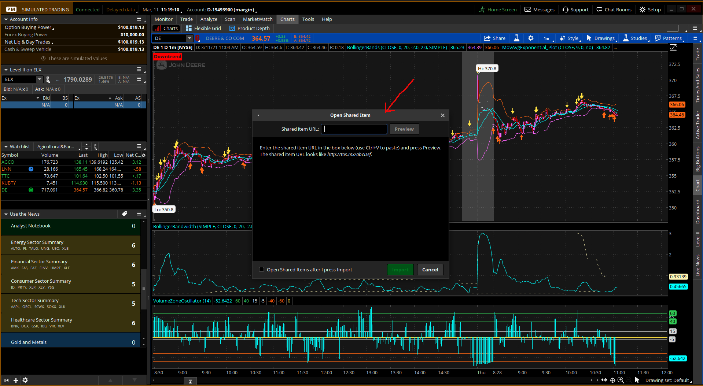
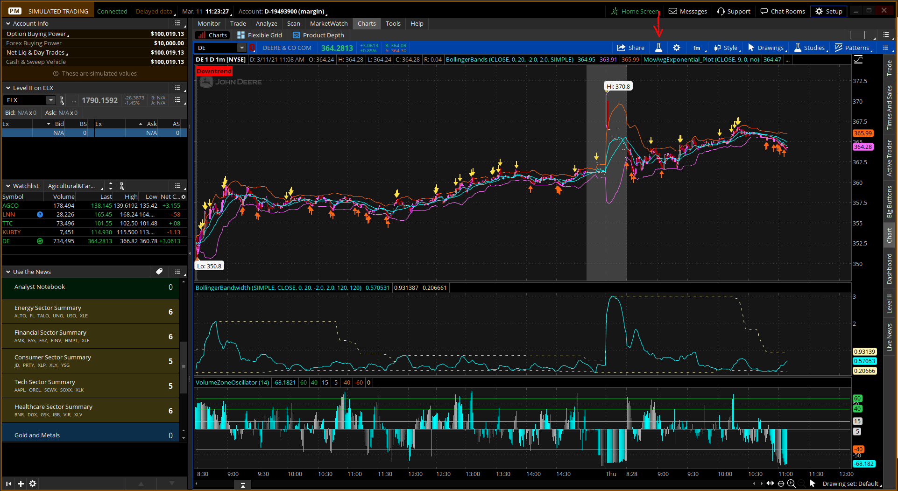
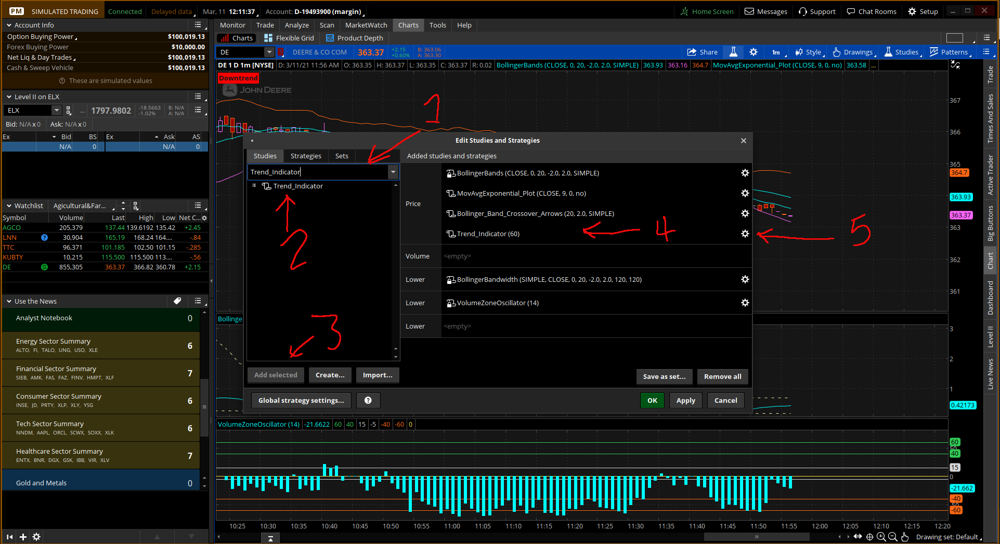
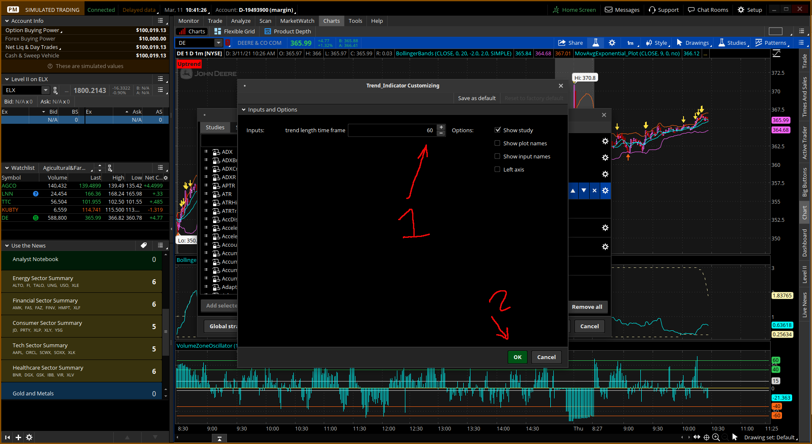
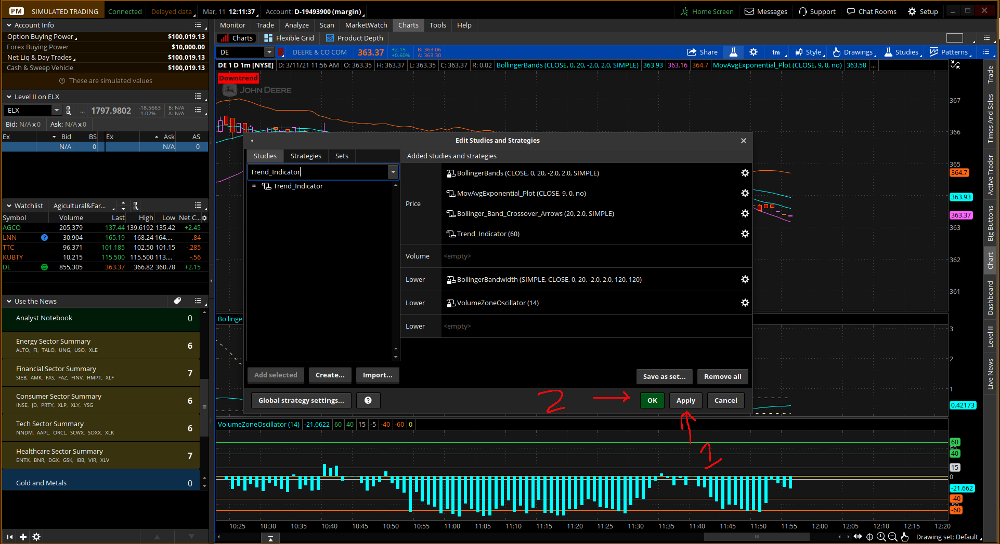
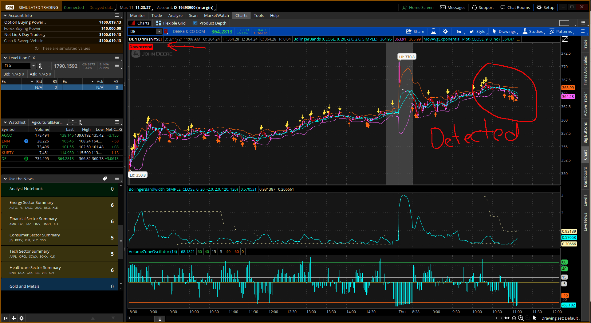

# Trend Indicator

**Discloser**  _In order to demonstrate the functionality of my script, I used actual symbol in the chart image. However, I do not make recommendations or determine the suitability of any security or strategy for individual traders. Any investment decision you make in your self-directed account is solely your responsibility._

I wrote this for Thinkorswim:tm: platform. This script can be used using this script code: http://tos.mx/3VcwV4A  

This will detect the trend of your chart based off the time of your chart and the time you set the Trend_Indicator to detect. Example: 1D 1M chart with trend length time frame at 5 would give you the trend for the past 5 bars. This will be displayed in the top left of your chart as either Uptrend or Downtrend.

## Here is how To Use

To import the script code:  
Go to top right of Thinkorswim platform window and click on the Gear Setup Icon tab.  
A drop-down menu will appear. From this menu select Open share item...  
This will open the Open Share Item window
  
From here you will enter the script code to install the Trend Indicator script.

Once imported into your Thinkorswim platform go to Edit Studies (Beaker Icon) from any chart window.
  
Once you click on the Edit Studies (Beaker Icon) this will open up the Edit Studies and Strategies window

From Here you can add Trend_Indicator to your chart.

1. This is where you can type in Trend_Indicator to look for it through hundreds of different Studies.
2. Trend_Indicator will be displayed in this area if you had imported it correctly. Highlight by clicking on Trend_Indicator in this area.
3. Now to add to chart you can click on Add selected.
4. Once added to your chart it will appear in Price area.
5. Clicking on the gear icon will access the customization of Trend_Indicator to make your trend detection more accurate.

This shows where to adjust the Trend Time Frame.
Set this for the length of time you want to check for a trend. 

Be aware this will be based off your time of the Chart being used. Example: 1D 1M chart with trend length time frame at 20 would give you the trend for the past 20 minutes.  

1. Displays the window where you can enter your time frame to detect your trend in your chart.
2. After entering your detection time, click on the ok tab to exit the Customizing window.  

Once you set your trend length time frame for your chart. You will need to:

1. Press Apply to add changes to your chart.
2. Press Ok to exit the Edit Studies and Strategies window.  

Now in the top left of your chart window the trend that the script had detected will be displayed.  **Remember this is based off the trend length time frame and your chart time.**
