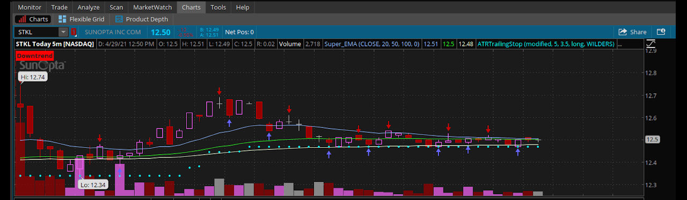

 
  

  &#xa0;

  <!-- <a href="https://tos_trend_indicator.netlify.app">Demo</a> -->

<h1 align="center">TOS_Trend_Indicator</h1>

  

  

  

  

  <!--  -->

  <!--  -->

  

<!-- Status -->

<!-- <h4 align="center"> 
	🚧  TOS_Trend_Indicator 🚀 Under construction...  🚧
</h4> 

 -->

  <a href="#gear-about">About</a> &#xa0; | &#xa0; 
  <a href="#newspaper-features">Features</a> &#xa0; | &#xa0;
  <a href="#scroll-requirements">Requirements</a> &#xa0; | &#xa0;
  <a href="#running-starting">Starting</a> &#xa0; | &#xa0;
  <a href="#hammer_and_wrench-use">Use</a> &#xa0; | &#xa0;
  <a href="#memo-license">License</a> &#xa0; | &#xa0;
  <a href="https://github.com/TechRancher" target="_blank">Author</a>

 

## :gear: About ##

**Disclaimer**  _In order to demonstrate the functionality of my script, I used actual ticker symbols in the chart images. However, I do not make recommendations or determine the suitability of any security or strategy for individual traders. Any investment decision you make in your self-directed account is solely your responsibility. Be sure to backtest any strategy to determine if you understand the risks involved with each strategy._  

This will detect the trend of your chart based on the time of your chart and the time you set the Trend_Indicator to detect. Example: 1D 1M chart with trend length time frame at 5 would give you the trend for the past 5 bars. This will be displayed in the top left of your chart as either Uptrend or Downtrend.  

## :newspaper: Features ##

:heavy_check_mark: Trend Detection;\
:heavy_check_mark: Displayed At Top Of Chart;\
:heavy_check_mark: Can Be Adjusted By User;

## :scroll: Requirements ##

:exclamation: Before starting you need to have [ThinkorSwim Platform](https://tdameritrade.com/tools-and-platforms.page) installed.  

## :running: Starting ##

After you have downloaded the ThinkorSwim:registered: platform and have it up and running. You can then download this script:  

- To download this script: [Trend Indicator Label](http://tos.mx/3VcwV4A)  

To import the script code:  
Go to the top right of the Thinkorswim platform window and click on the Gear Setup Icon tab.  
A drop-down menu will appear. From this menu select Open share item...  
This will open the Open Share Item window
  
From here you will enter the script code to install the Trend Indicator script.  Or you can install from the website that the link above will take you too.
  
## :hammer_and_wrench: Use ##  

Once imported into your Thinkorswim platform go to Edit Studies (Beaker Icon) from any Chart window.
  
Once you click on the Edit Studies (Beaker Icon) this will open up the Edit Studies and Strategies window

From Here you can add Trend_Indicator to your chart.

1. This is where you can type in Trend_Indicator to look for it through hundreds of different Studies.
2. Trend_Indicator will be displayed in this area if you had imported it correctly. Highlight by clicking on Trend_Indicator in this area.
3. Now to add to the chart you can click on Add selected.
4. Once added to your chart it will appear in Price area.
5. Clicking on the gear icon will access the customization of Trend_Indicator to make your trend detection more accurate.

This shows where to adjust the Trend Time Frame.
Set this for the length of time you want to check for a trend.  

**Be aware this will be based off your time of the Chart being used.** Example: 1D 1M chart with trend length time frame at 20 would give you the trend for the past 20 minutes.  

1. Displays the window where you can enter your time frame to detect your trend in your chart.
2. After entering your detection time, click on the ok tab to exit the Customizing window.  

Once you set your trend length time frame for your chart. You will need to:

1. Press Apply to add changes to your chart.
2. Press Ok to exit the Edit Studies and Strategies window.  

Now in the top left of your chart window the trend that the script had detected will be displayed.  **Remember this is based off the trend length time frame and your chart time.**

## :memo: License ##

This project is under license from MIT. For more details, see the [LICENSE](LICENSE) file.

Made with :heart: by <a href="https://github.com/TechRancher" target="_blank">J Sikes</a>

&#xa0;

<a href="#top">Back to top</a>
